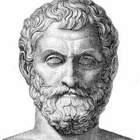

<div align="center">



# Thales

*"Know thyself." — Thales of Miletus (c. 624–546 BC)*

[](https://hub.docker.com/)
[](https://www.gnu.org/licenses/agpl-3.0)
[](https://www.python.org/)

*An Ancient Wisdom Engine for Modern Prediction*

</div>

---

## 🌊 Overview

**Thales** is a next-generation swarm intelligence engine inspired by the world's first philosopher — Thales of Miletus, who believed that *all things are made of water* and that the universe operates through observable, rational principles.

Just as Thales gazed at the night sky and predicted a solar eclipse centuries before modern astronomy, **Thales the engine** looks at the currents of real-world data — news, signals, social dynamics — and builds a living digital mirror of the world. Thousands of autonomous agents, each with their own memory, personality, and behavioral logic, interact freely within this simulated cosmos. From this collective emergence, futures can be glimpsed.

> You only provide: seed materials (reports, articles, signals) and a description of what you wish to foresee.
> Thales returns: a richly detailed prediction report and a fully interactive simulated world to explore.

---

## 🏛️ Philosophy

Thales of Miletus taught us that beneath the surface of all things lies a hidden unity — a single principle from which all complexity flows.

**Thales the engine** is built on the same conviction:

- **At the Macro Level** — A rehearsal theatre for decision-makers: policies, strategies, and public narratives can be stress-tested at zero cost before being deployed in the real world.
- **At the Micro Level** — A philosopher's sandbox for individuals: explore counterfactuals, deduce story endings, or simply ask *"what if?"* and watch the world answer.

From the gravity of geopolitical forecasting to the playful curiosity of a thought experiment, Thales makes every question worth simulating.

---

## 🔄 How It Works

```
Seed Extraction
      ↓
Graph Construction (GraphRAG + entity relationships)
      ↓
Agent Population (persona generation, memory injection)
      ↓
Parallel Simulation (dual-platform, dynamic temporal updates)
      ↓
ReportAgent (deep analysis, interactive Q&A)
      ↓
Prediction Report + Living Digital World
```

### The Four Pillars

**1. Graph Building**
Seed materials are distilled into structured knowledge graphs. Individual and collective memories are injected. GraphRAG ensures agents understand the world they inhabit.

**2. Environment Setup**
Entity relationships are extracted, personas are generated from the data, and each agent is configured with its own backstory, motivations, and behavioral tendencies.

**3. Simulation**
The digital world runs on two parallel platforms simultaneously. Prediction requirements are automatically parsed. Memory evolves dynamically as time advances within the simulation.

**4. Deep Interaction**
Once the simulation concludes, you may converse with any agent in the simulated world — or interrogate the ReportAgent for nuanced, layered analysis of what transpired.

---

## 🚀 Quick Start

### Option 1: Source Code (Recommended)

**Prerequisites**

| Tool | Version | Purpose |
|------|---------|---------|
| Node.js | 18+ | Frontend runtime |
| Python | ≥3.11, ≤3.12 | Backend runtime |
| uv | Latest | Python package manager |

**Step 1 — Configure Environment Variables**

```bash
cp .env.example .env
# Open .env and fill in your API keys
```

Required variables:

```env
# LLM API (OpenAI-compatible — any provider works)
LLM_API_KEY=your_api_key
LLM_BASE_URL=https://your-provider.com/v1
LLM_MODEL_NAME=your-model-name

# Zep Cloud (long-term agent memory)
# Free tier available at: https://app.getzep.com/
ZEP_API_KEY=your_zep_api_key
```

**Step 2 — Install Dependencies**

```bash
# Install everything at once
npm run setup:all

# Or step by step:
npm run setup          # Node + frontend
npm run setup:backend  # Python backend (auto virtual env)
```

**Step 3 — Start Thales**

```bash
npm run dev
```

| Service | URL |
|---------|-----|
| Frontend | http://localhost:3000 |
| Backend API | http://localhost:5001 |

You can also start each service independently:

```bash
npm run backend    # backend only
npm run frontend   # frontend only
```

---

### Option 2: Docker

```bash
# 1. Configure environment
cp .env.example .env

# 2. Pull and launch
docker compose up -d
```

Ports mapped: **3000** (frontend) / **5001** (backend). Mirror images for faster pulls are noted as comments in `docker-compose.yml`.

---

## 📬 Join the Conversation

The Thales team welcomes contributors, researchers, and curious minds.

If you are passionate about multi-agent simulation, emergent intelligence, or LLM applications — open an issue, start a discussion, or reach out.

---

## 📄 Acknowledgments

Thales stands on the shoulders of giants:

- The simulation core is powered by **[OASIS](https://github.com/camel-ai/oasis)** — Open Agent Social Interaction Simulations. Deep gratitude to the **CAMEL-AI** team for their outstanding open-source contributions.
- *Inspired by the life and thought of **Thales of Miletus** — the first philosopher, mathematician, and natural scientist of the Western tradition.*

> **Note:** This project is a fork of [MiroFish](https://github.com/666ghj/MiroFish), from which it draws its foundational architecture. Credit goes to the original authors for the extraordinary work that made Thales possible.

---

<div align="center">

*"The most difficult thing in life is to know yourself."*
— Thales of Miletus

</div>
